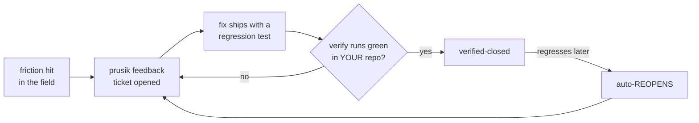

# Prusik

[](https://github.com/getprusik/prusik/actions/workflows/ci.yml) [](https://pypi.org/project/prusik/) [](https://pypi.org/project/prusik/) [](https://github.com/getprusik/prusik/blob/main/LICENSE)

**Prusik is an independent verification layer for AI coding agents.** Agents write the code; prusik proves the work — that tests really executed, changes stayed in scope, and every "done" has evidence behind it. It's named after the climbing knot: slides freely while you work, grips instantly under load.

AI agents now write code faster than anyone can review it — and they routinely report success that didn't happen: green suites where nothing ran, tests bent to match a bug, changes far outside what you asked for. Reviewing harder doesn't scale, and an agent's report can never be evidence for its own work — which makes an independent verification layer a structural requirement of the agentic SDLC, not an add-on. Prusik is that layer: it sits **outside** the agent and verifies from the tools' own output — **proof, not opinion.**

| Without prusik | With prusik |
|---|---|
| "Tests pass ✅" is the agent's claim | Verdict from the runner's own output: N executed, exit 0 — or **NOT PROVEN** |
| An all-skip suite reads green in CI | Exit 0 with 0 executed **fails**, rc=1 |
| The agent bends the failing test to fit the bug | Acceptance tests must **fail without the change** ([prove-red](#commands-that-matter-most)) |
| Two sessions on one checkout silently destroy work | Single-writer lease on the shared tree; worktrees stay parallel |
| A fix ships, then quietly regresses | Closed findings re-verify — a regression **auto-reopens the ticket** |
| "Done" = a persuasive summary | "Done" = captured evidence in an append-only ledger you can hand an auditor |

Free, Apache-2.0, **no telemetry, no account, no phone-home** — a verification tool you don't have to trust blindly would be a contradiction. The `prove` / `scan` / `feedback` layer works with **any** agent or CI; the full phase-gated harness targets Claude Code today. Backed by [1,300+ tests](tests/), including [59 regression tests](prusik/_closures.json) harvested from real field findings — every one born from a defect an adopter hit, fixed, and proof-closed ([CI](https://github.com/getprusik/prusik/actions/workflows/ci.yml)).

## Prove your agent's tests actually ran (30 seconds, zero config)

No `init`, no config, no buy-in — install and prove:

```bash
pip install prusik

prusik prove -- pytest -q
prusik prove --kind types -- mypy src/
prusik prove --min 20 --json -- pytest tests/
```

### The receipt

Here's a suite where every test is skip-marked ("needs staging env"). The agent — and your CI — call this green:

```console
$ pytest -q
2 skipped in 0.01s
$ echo $?
0
```

Prusik reads the runner's own output and refuses:

```console
$ prusik prove -- pytest -q
[prusik-prove] ✗ NOT PROVEN — exit 0 but only 0 test(s) executed (need ≥1)
    — nothing actually ran (auto-skip / no collection / wrong path).
    Exit 0 with no executed tests is a false-clean.
$ echo $?
1
```

The verdict counts tests **executed** (passed + failed), not tests *discovered* — a suite that collects 100 and skips 100 is a false-clean, and tools that only check "tests were found" wave it through. Verdicts are **deterministic**: a pure function of the tool's own exit code and output — same output, same verdict, no model in the loop. Drop `prove` into CI or a pre-push hook as a one-line anti-fabrication check. That's the whole pitch; everything below is opt-in from here.

### In CI: one step, as a GitHub Action

The repo doubles as a composite Action — `prove` as a PR gate with no workflow scripting:

```yaml
- uses: getprusik/prusik@main
  with:
    source: prove
    command: "pytest -q"
    fail-on-findings: "true"   # NOT PROVEN fails the check
```

It posts the verdict as a PR comment (editing its own comment on re-runs, not spamming the thread), and can run `scan` / `verify-loop` / `findings` the same way — non-gating decision support by default, a gate when you say so.

## Adopt at your own pace — every rung reversible

1. **`prusik prove` in CI** — zero footprint, works with any agent or none; your first false-clean pays for the install.
2. **`prusik scan`** — read-only static detectors over the repo (binding mismatches, unreachable tests); nothing written.
3. **`prusik init` on a branch** — the full harness, 47 files, every one manifest-tracked; `prusik doctor` scores the setup in 10 seconds.
4. **`prusik uninstall`** — manifest-exact removal any time; your own edits stay. A trial costs a branch, not a commitment.

## The loop: findings close on proof — and reopen themselves



File a finding with `prusik feedback`. It becomes a git-tracked ticket whose closure is **derived from its verify history** — a fix counts as done only when a verify command runs green *in your repository*, with real tests executed. There is no stored status flag to drift: state is recomputed from the verify history on every read, so a ticket cannot sit closed against a red verify. Engine fixes backed by a shipped regression test close by proof-transfer on `prusik update` (and go red again on a downgrade). If a closed finding regresses, it reopens itself. Nobody's word is ever the record.

Field record to date: **43 findings filed by design-partner products, 43 verified-closed in the field, zero open** — including same-day cycles from field incident to shipped fix to proof-closed ticket.

## The full harness

`prusik init` scaffolds a phase-gated harness for Claude Code agent teams: writable-path enforcement, cross-session write serialization, schema-validated artifacts, adversarial critic roles, deterministic triage, a watchdog, and the ledger. One feature, end-to-end:

```
/brief-new email-receipts                        # 5-field wizard; writes briefs/email-receipts.md
/sprint-start email-receipts                     # brief-critic PASS required before scoping
/sprint-advance triage --feature email-receipts  # pure-code solo vs team routing
<builders work in isolated worktrees>
/sprint-advance reviewing                        # regression + conventions gates
/sprint-advance integrating                      # integrator merges; full-suite gate
/sprint-complete email-receipts                  # success criteria verified, with evidence
```

At every step prusik enforces, mechanically:

- **Writable paths by phase** — a write outside the phase's set is denied *when attempted*, with the worktree redirect in the message
- **One writer on the shared tree** — concurrent sessions (including ad-hoc, sprint-less ones) can't stomp each other; a TTL lease serializes main while worktrees stay parallel
- **Evidence at every advance** — a phase exits on captured tool output (tests executed, files checked), never on a report
- **Load-bearing acceptance tests** — `prove_red` criteria must FAIL without the change; a verify that was green all along is vacuous and rejected
- **Honest residuals** — a leftover red needs a machine-verified category (proven pre-existing via git-stash A/B, or environment-gap), not a prose excuse
- **Bounded fix-rounds** — review loops cap and escalate to a recorded human decision instead of spinning

**What it costs you, honestly:** ceremony is proportional, not flat. Small changes take the trivial lane (`sprint --lane trivial` — bug fixes, docs, config skip the scoping/planning critics but keep the correctness floor); full ceremony is reserved for features where blast radius lives. Every gate's friction is itself measured — `prusik catches` reports each gate's true-catch vs false-block ratio from your own ledger, so a gate that never earns its keep is visible and yours to disable. And `prusik disable` pauses everything, reversibly, the moment it's in your way.

## For the team lead — and the auditor

The same ledger that gates the work is your audit trail. Every gate block, phase transition, evidence capture, and finding closure is an append-only event:

```bash
prusik metrics --json      # defect-prevention scorecard: what was flagged/caught/blocked (factual event counts)
prusik catches             # per-gate true-catch vs false-block ratio — is each gate earning its friction?
prusik trust-report --html report.html   # per-repo dossier: fidelity probe + catches + prevention, shareable
prusik scan --sarif        # findings as SARIF 2.1.0 → GitHub code-scanning
```

Every number is a recorded event — not a modeled "bugs prevented" estimate. `prusik eval scorecard` goes further: it injects known defects (scope drift, premature push, fabricated done) and proves this config's gates catch them, exiting non-zero if any signal regressed.

## Adopt / pause / remove

```bash
cd your-project
prusik init          # refuses on a dirty tree; scaffolds 47 files, all manifest-tracked
prusik doctor        # score your harness across 5 subsystems, 10 seconds, concrete next step
prusik status        # current phase / sprint state
prusik update        # sync templates + auto-close findings your new version fixed
prusik disable       # pause hooks without removing files (reversible)
prusik uninstall     # manifest-based: removes only what prusik wrote, your edits stay
```

Everything `init` writes is tracked in a content-hashed manifest, so `uninstall` is exact and your customizations survive. Run trials on a branch; removal is verifiable, not hopeful.

## Commands that matter most

| Command | What it does |
|---|---|
| `prusik prove [--kind tests\|lint\|types] [--min N] -- <cmd>` | Prove a command ran clean from its own output; `--sarif` for code-scanning |
| `prusik scan` | Static detectors (binding-mismatch, test-reach) + your own, day-1, no FSM needed |
| `prusik init` / `doctor` / `update` / `uninstall` | Adopt, self-assess, stay current, leave cleanly |
| `prusik feedback "…" --kind bug --repro "…"` | File a finding → git-tracked ticket that closes only on proof |
| `prusik gate prove-red --feature F` | Capture the RED baseline: prove acceptance tests fail without the change |
| `prusik gate baseline prove --test ID` | Prove a failing test pre-dates the sprint (git-stash A/B), never launder a new one |
| `prusik gate release-writer` | Audited hand-off of the shared-tree single-writer lease |
| `prusik triage --feature F` | Solo-vs-team routing, pure code, zero tokens |
| `prusik digest` / `metrics` / `catches` / `trust-report` | Ledger → outcomes, scorecard, gate precision, shareable dossier |
| `prusik eval scorecard` | Inject known defects; prove your gates still catch them (rc≠0 on regression) |

<details>
<summary><b>Full command surface</b> (40+ subcommands)</summary>

Run `prusik --help` for the complete list. Highlights beyond the table above: `discovery` (deterministic inventory + dep-graph), `watchdog` (heartbeat/staleness incidents), `affected-tests` (fail-fast selection), `cross-check` (parallel-builder symbol collisions), `plan-reach` / `blast-verify` / `blast-recall` (blast-radius predicted → consumed → measured), `absence-check` / `narrative-check` / `delta-check` (recall detectors: promised-but-absent deliverables, unproven prose claims, silently-dropped tests), `infra-check`, `criterion resolve`, `permissions audit`, `serve` (local brief-authoring form), `ci-comment`.

</details>

## Concepts

**Engine vs opinions.** Prusik ships the enforcement engine; your standards come from convention packs and `sprint-config.yaml`. The FSM's phases declare `writable` globs, denied commands, exit artifacts with schema validation, and budgets — all enforced by hooks, all yours to tune.

**Evidence, precisely.** For tests, "real work" means executed = passed + failed, parsed from the runner's own summary — skips and collection counts never satisfy a gate. For lint/types it's files-checked from the tool's own scope report. Unparseable output proves nothing, and unproven blocks.

**The ledger is the memory.** `.sprint/ledger.jsonl` is append-only: every transition, block, capture, incident, and completion. `digest` turns it into outcome stats (escalation rate, prediction error, gate blocks by phase); `metrics` and `catches` turn it into the value story. Self-tuning happens by reading the ledger, not by trusting recollection.

<details>
<summary><b>Engine internals</b> (module map)</summary>

| Module | Purpose |
|---|---|
| `evidence.py` | The anti-fabrication primitive: `executed_count` + `prove_verdict`, shared by `prove` and `gate capture` |
| `gate.py` | Hook + CLI entry points; the phase gate policy over a host-neutral ToolEvent |
| `main_writer.py` | Single-writer TTL lease on the shared tree (cross-session serialization) |
| `phases.py` | Phase FSM; writable-path resolution; sprint state |
| `feedback.py` / `feedback_store.py` | Findings capture + the proof-derived ticket lattice (verified-close / reopen) |
| `baseline.py` | Known-failure baselines: git-stash-proven pre-existing flakes, never laundering |
| `schema.py` | Brief/scope/plan validation + repo cross-references |
| `discovery.py` + plugins | Deterministic inventory + dep-graph (Python AST; JS/TS/Go regex) |
| `triage.py` | Pure-code solo/team routing |
| `watchdog.py` | Heartbeats, staleness, budget incidents |
| `ledger.py` | Append-only event log + digest |
| `changelog.py` + `_closures.json` | Shipped closure map: finding-id → fix version, ground-truthed from test markers |

</details>

## Composes with your stack — including other agents

Prusik operates at one layer: **build-time process discipline and evidence**. IDE agents and assistants (Copilot Workspace, IBM Bob, Cursor, or Claude Code itself) do the work; **prusik checks the receipt** — it composes with all of them and competes with none. The `behavior_regression` and `project_policy` hooks invoke any command that exits non-zero on failure: your pre-commit pipeline, a browser smoke suite, an architectural gate, another reviewer.

<details>
<summary><b>Layer-by-layer comparison</b> (when to use something else)</summary>

| Tool | Layer | When to use it instead |
|---|---|---|
| [sentrux](https://github.com/sentrux/sentrux) | Architectural measurement | Continuous quality signal; **composes** via `behavior_regression` |
| [roborev](https://github.com/kenn-io/roborev) | Continuous per-commit review | Review every commit vs at phase boundaries; **composes** |
| [future-agi](https://github.com/future-agi/future-agi) | Production observability | Runtime tracing/evals — prusik ends at sprint-complete |
| [Graphify](https://github.com/Graphify-Labs/graphify) | Codebase knowledge graph | Deep traversal queries; prusik's `discovery` is the lighter built-in |
| [helmor](https://github.com/dohooo/helmor) | Desktop session UI | A GUI for agent sessions; prusik is headless |
| [GitHub Spec Kit](https://github.com/github/spec-kit) | Pre-planning | Waterfall spec-then-build posture |
| [LangGraph](https://github.com/langchain-ai/langgraph) / [AutoGen](https://github.com/microsoft/autogen) / [CrewAI](https://github.com/crewAIInc/crewAI) | Orchestration frameworks | Building a custom agent runtime from scratch |
| Bare Claude Code | — | Small one-off projects where enforcement isn't worth it yet |

</details>

## Honest limits

- **Claude Code-coupled today.** The hook contract ships one adapter (Claude Code). The gate policy itself is host-neutral behind an adapter seam; a second runtime lands when a real adopter needs it.
- **Depth is not gateable.** Schemas catch structure; critic roles add judgment in isolated contexts — but shallow thinking still needs a human reading `design/` sometimes.
- **Runner parsing is Python/JS-deep.** Evidence extraction reads pytest and vitest (tests) and mypy, tsc, ruff, eslint (lint/types) from their own output. Other runners (JUnit/Gradle, `go test`, `cargo test`) are unparseable today — which means **unproven, and unproven blocks**; support lands when an adopter needs it, not speculatively.
- **Python-AST-privileged discovery.** JS/TS/Go are regex-based (good enough for scoping); Rust/Java/Ruby unsupported until tree-sitter lands (recurrence-gated).
- **No UI, no production runtime.** CLI + hooks by design; pair with the tools above for dashboards and runtime observability.

## Self-hosting

Prusik develops itself with prusik: the repo's own `.claude/` wires the same hooks, the same gates, the same ledger. The 59 field-finding regression tests in this suite are the moat that closed real adopter tickets — the loop in this README is the loop that built it.

<details>
<summary><b>Repository layout</b></summary>

```
prusik/                    — engine
  discovery_plugins/       — per-language graph builders
  issue_plugins/           — per-tracker sync
  templates/               — copied into target projects by `prusik init`
benchmarks/ examples/      — sample-repo fixtures for detectors + evals
tests/                     — 1,300+ tests incl. 59 field-finding regression tests
.claude/                   — self-host: prusik's own harness config
```

</details>

## License

Apache 2.0. See [LICENSE](LICENSE) and [NOTICE](NOTICE).
